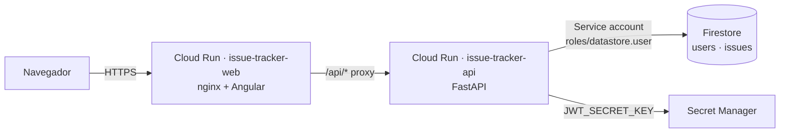

# IssueDesk · Issue Tracker

Aplicación web full stack para la gestión de incidencias, construida con **Angular 22**, **Python 3.13 + FastAPI**, **Google Firestore** y desplegada en **Google Cloud Run**.

**Autor:** Luis Jiménez ([@elitecoderdev](https://github.com/elitecoderdev))

| Recurso | URL |
| --- | --- |
| Aplicación web | https://issue-tracker-web-426124835343.us-central1.run.app |
| API REST | https://issue-tracker-api-426124835343.us-central1.run.app/api |
| Documentación interactiva (Swagger) | https://issue-tracker-api-426124835343.us-central1.run.app/api/docs |
| Colección Postman | [`postman/IssueDesk.postman_collection.json`](postman/IssueDesk.postman_collection.json) |

## Usuarios de prueba

No existe alta de usuarios (fuera del alcance del examen). Los siguientes usuarios están cargados en Firestore con la contraseña almacenada como hash **Argon2id**:

| Usuario | Contraseña | Nombre |
| --- | --- | --- |
| `evaluador` | `Gapsi#Evalua2026` | Evaluador Técnico |
| `admin` | `Gapsi#Admin2026` | Administrador Gapsi |
| `analista` | `Gapsi#Analista2026` | Laura Analista |

## Funcionalidad

- Inicio y cierre de sesión con usuario y contraseña (JWT).
- Listado de incidencias con fecha de última actualización y autor.
- Creación de incidencias con título, descripción y prioridad (alta, media, baja).
- Actualización del estado (abierta, en progreso, completada) y de la prioridad directamente desde el listado.
- Filtros por estado y por prioridad (combinables), más búsqueda por texto.
- Resumen con el total de incidencias y la cantidad por estado; cada tarjeta del resumen también funciona como filtro.

## Arquitectura



- El frontend y la API se publican como dos servicios de Cloud Run independientes.
- nginx sirve la SPA y hace proxy de `/api/*` hacia la API. El navegador trabaja siempre contra un solo origen, así que no hace falta CORS en producción.
- La API usa una cuenta de servicio dedicada con permisos mínimos. La clave de firma JWT vive en **Secret Manager**: no está en el repositorio ni en variables de entorno planas.
- Ambos servicios escalan a cero (`min-instances=0`) para mantener el costo en la capa gratuita.

## Estructura del repositorio

```
.
├── backend/     API REST en FastAPI (ver backend/README.md)
├── frontend/    SPA en Angular (ver frontend/README.md)
├── postman/     Colección Postman con pruebas automáticas
└── infra/       Scripts de despliegue y baja en GCP
```

## Ejecución local rápida

```bash
cd backend
python -m venv .venv && source .venv/bin/activate
pip install -r requirements-dev.txt
cp .env.example .env
uvicorn app.main:app --reload --port 8000
```

```bash
cd frontend
npm ci
npm start
```

La SPA queda en `http://localhost:4200` y el proxy de desarrollo (`proxy.conf.json`) envía `/api` a `http://localhost:8000`. Con `REPOSITORY_BACKEND=memory` la API trabaja en memoria. Para cargar usuarios se usa `python -m scripts.seed scripts/seed_data.json` apuntando a Firestore; los detalles están en el README de cada proyecto.

## Despliegue

```bash
PROJECT_ID=<tu-proyecto> ./infra/deploy.sh
```

El script habilita las APIs y crea la base Firestore con sus índices compuestos. También crea la cuenta de servicio, genera el secreto JWT y despliega ambos servicios en Cloud Run. `infra/teardown.sh` elimina todos los recursos creados.

## Calidad

| Proyecto | Comando | Resultado |
| --- | --- | --- |
| Backend | `pytest` | 45 pruebas · **99.7 % de cobertura** (líneas y ramas) · el build falla si baja del 95 % |
| Backend | `ruff check .` | Sin observaciones |
| Backend | `pip-audit -r requirements.txt` | Sin vulnerabilidades conocidas |
| Frontend | `ng test --coverage` | 122 pruebas en 24 archivos · **99.8 % statements, 99.6 % ramas, 99.3 % funciones, 100 % líneas** · umbral obligatorio del 95 % |
| Frontend | `npm audit --omit=dev` | 0 vulnerabilidades |
| Frontend | `ng build` | Build de producción con modo estricto de TypeScript y de plantillas |

Las pruebas del backend usan una implementación simulada de Firestore (`tests/fakes.py`), así que el repositorio real se prueba sin depender de GCP.
